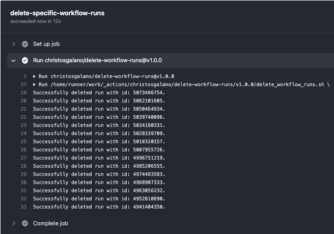

# GitHub Actions: Custom Actions

> **A guide to creating your own actions**

## Overview

GitHub Actions provides a flexible and powerful platform for automating tasks in your repository. With custom actions, you can write code that interacts with your repository, leveraging GitHub's APIs and third-party integrations. Whether it's publishing npm modules, sending alerts, or deploying code, custom actions extend the functionality of GitHub Actions to meet your specific needs.

Custom actions can be used in your own workflows or shared with the GitHub community (requires public repository). Actions can run directly on a machine or within a Docker container, and you can define inputs, outputs, and environment variables to customize their behavior.

Sharing your custom actions fosters collaboration within the GitHub community, while leveraging actions developed by others saves time and effort. With custom actions, you can tailor automation workflows, promote knowledge sharing, and benefit from the expertise of the GitHub community.

## Types of custom actions

There are three types of custom actions:

- Docker container
- JavaScript
- Composite

### Docker container actions

Docker container actions package the environment along with the GitHub Actions code, ensuring consistency and reliability. You can use specific versions of the operating system, dependencies, tools, and code within a Docker container. This is particularly useful when actions require specific environment configurations. Keep in mind that Docker container actions can only run on runners with a Linux operating system, and self-hosted runners must have Docker installed.

### JavaScript actions

JavaScript actions run directly on the runner machine and separate the action code from the environment used to run it. They execute faster than Docker container actions and are compatible with all GitHub-hosted runners (Ubuntu, Windows, and macOS). When creating JavaScript actions, it's best to rely on pure JavaScript code without depending on other binaries. If you're developing a Node.js project, consider using the GitHub Actions Toolkit packages to speed up development.

### Composite actions

Composite actions allow you to combine multiple workflow steps within a single action. They are useful for bundling commands into a single step and simplifying complex workflows. By creating composite actions, you can improve the readability and maintainability of your workflows. Check out the "Creating a composite action" guide for an example of how to create and use composite actions effectively.

## Metadata syntax

All custom actions must contain a metadata file named `action.yml` in the root directory of the repository. This file contains information about the action, including its name, description, inputs, and outputs. The metadata file is written in YAML syntax. The basic components of the metadata file are as follows:

- `name`: The name of the action. This is displayed in the Actions tab when the action is used in a workflow.
- `description`: A short description of the action. This is displayed in the Actions tab when the action is used in a workflow.
- `inputs`: A list of input parameters that the action accepts. Each input parameter has a name, description, and default value. The default value is used if the input parameter is not specified in the workflow file.
- `outputs`: A list of output parameters that the action returns. Each output parameter has a name and description.
- `runs`: The command or executable that runs when the action is executed. This can be either a shell command or an executable. If the action is a Docker container action, this is the entrypoint for the container.

The following example shows the metadata file for a custom, composite action named `hello-world-action`:

```yaml
name: 'Hello World Action'
description: 'Greet someone and record the time'
inputs:
  who-to-greet:  # id of input
    description: 'Who to greet'
    required: true
    default: 'World'
outputs:
  time: # id of output
    description: 'The time of the greeting'
    value: ${{ steps.time.outputs.TIME }}
runs:
    using: 'composite'
    steps:
    - run: echo "Hello ${{ inputs.who-to-greet }}!"
      shell: bash
    
    - id: time 
      run: echo "TIME=$(date)" >> $GITHUB_OUTPUT
      shell: bash
```

We can see that the purpose of the above action is to greet someone and record the time. The action accepts a single input parameter named `who-to-greet`, which has a default value of `World`. The action returns a single output parameter named `time`, which contains the time of the greeting.

The action is composite and basically what it does is run two steps: the first step prints the greeting, and the second step records the time.

## Choosing a location for your action

If you intend to share your action with others, it's recommended to keep it in its own public repository. This allows you to version, track, and release the action independently. Storing the action separately facilitates its discovery by the GitHub community, simplifies issue fixing and extension development, and decouples the action's versioning from other application code. However, if you're building an action for personal use, you can store it in any location within your repository. To combine action, workflow, and application code in a single repository, it's advisable to store actions in the `.github` directory, such as `.github/actions/action-a` and `.github/actions/action-b`.

## Referencing an action

Let's take a look at some examples of how to reference an action in your workflow file:

```yaml
steps:
    # Published actions
    
    ## Referencing major release tag
    - uses: actions/javascript-action@v1

    ## Referencing full release tag (MAJOR.MINOR.PATCH)
    - uses: christosgalano/delete-workflow-runs@v1.0.0

    ## Referencing a branch
    - uses: christosgalano/delete-workflow-runs@main
    
    ## Referencing a commit's SHA
    - uses: actions/javascript-action@a824008085750b8e136effc585c3cd6082bd575f

    # Unpublished actions
    
    ## Referencing your own action from the same repository
    - uses: ./.github/actions/my-action
    
    ## Referencing your own action from a different repository
    - uses: owner/repo-name/.github/actions/my-action@main
```

## Example

Now let's go over a GitHub Action that i wrote and published to the GitHub Marketplace. The action is called [delete-workflow-runs](https://github.com/christosgalano/delete-workflow-runs) and its purpose is to delete the workflow runs for a given repository (whether it is a specific workflow or all the runs of the repository).

The metadata file for the action is as follows:

```yaml
name: "Delete Workflows Runs"
author: "Christos Galanopoulos"
description: "Delete the workflow runs for a given repository"
inputs:
  owner:
    description: "Specify the repository owner"
    required: true
  repo:
    description: "Specify the repository name"
    required: true
  token:
    description: "Specify the token used to get and delete the workflow runs"
    default: ${{ github.token }}}
    required: true
  workflow:
    description: "Specify the workflow name to delete the runs for"
    default: "all"
    required: false
branding:
  icon: delete
  color: gray-dark
runs:
  using: "composite"
  steps:
    - shell: bash
      env:
        OWNER: ${{ inputs.owner }}
        REPO: ${{ inputs.repo }}
        TOKEN: ${{ inputs.token }}
        WORKFLOW: ${{ inputs.workflow }}
      run: |
        ${{ github.action_path }}/delete_workflow_runs.sh \
          -o ${{ env.OWNER }} \
          -r ${{ env.REPO }} \
          -t ${{ env.TOKEN }} \
          -w ${{ env.WORKFLOW }}
```

We can see that the action accepts four input parameters: `owner`, `repo`, `token`, and `workflow`. The `owner` and `repo` parameters are required, while the `token` and `workflow` parameters are optional. The `token` parameter has a default value of `${{ github.token }}`. The `workflow` parameter has a default value of `all`, which means that if the user does not specify a workflow name, all the workflow runs of the repository will be deleted.

The action is composite and basically what it does is run a single step, which is a [**shell script**](https://github.com/christosgalano/delete-workflow-runs/blob/main/delete_workflow_runs.sh) that deletes the workflow runs for the given repository.

A possible workflow file that uses the above action is as follows (also [**here**](../../.github/workflows/delete_workflow_runs.yaml)):

```yaml
name: delete-workflow-runs
run-name: ${{ github.workflow }}
on:
  workflow_dispatch:
    inputs:
      repo_name:
        description: "Specify the name of the repository"
        required: true
        type: string
      workflow_name:
        description: "Specify the name of the workflow"
        required: false
        type: string

jobs:
  delete-specific-workflow-runs:
    if: inputs.workflow_name != ''
    runs-on: ubuntu-latest
    steps:
      - uses: christosgalano/delete-workflow-runs@v1.0.0
        with:
          owner: ${{ github.repository_owner }}
          repo: ${{ inputs.repo_name }}
          token: ${{ secrets.WORKFLOWS_MANAGER_PAT }}
          workflow: ${{ inputs.workflow_name }}
  
  delete-all-workflow-runs:
    if: inputs.workflow_name == ''
    runs-on: ubuntu-latest
    steps:
      - uses: christosgalano/delete-workflow-runs@v1.0.0
        with:
          owner: ${{ github.repository_owner }}
          repo: ${{ inputs.repo_name }}
          token: ${{ secrets.WORKFLOWS_MANAGER_PAT }}
```

And here is a possible output of the above workflow:



## Summary

To summarize, GitHub Actions allows users to create and reuse their own actions in their workflows so that they can automate repetitive tasks and save time. They can be written in any language and run on any operating system, and they can be used to perform a variety of tasks such as building, deploying code, running tests, and sending notifications. They can be stored in a separate repository, shared and reused across multiple projects and teams, and also versioned to ensure they are tested and working correctly before they are used in production.

## References

- [**Creating actions**](https://docs.github.com/en/actions/creating-actions)
