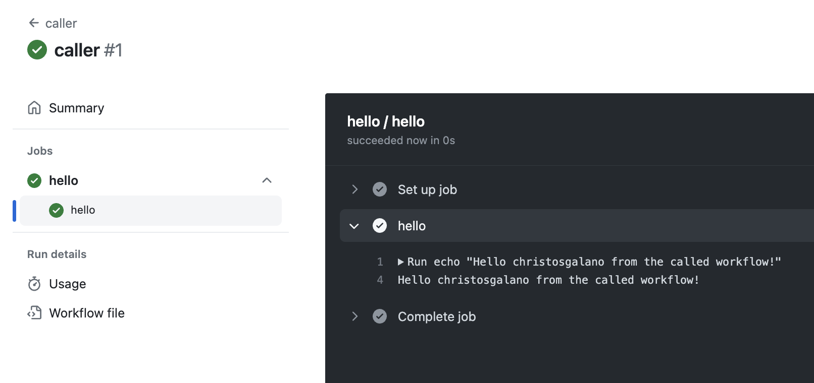

# GitHub Actions: Reusable Workflows

Maximizing Efficiency with Reusable Workflows in GitHub

## Overview

Reusable workflows are a way to define a workflow once and reuse it across multiple repositories and workflows. With reusable workflows, you can create a single, standard workflow that can be easily shared and used by your team. This helps to reduce the duplication of effort and makes it easier to maintain your workflows.

## Let's get specific

A workflow that uses another workflow is referred to as a "caller" workflow. The reusable workflow is a "called" workflow.

Any actions in the called workflow run as though they were a part of the caller workflow when you reuse a workflow from a different repository. For instance, if the called workflow uses `actions/checkout`, the action checks out the contents of the repository that hosts the caller workflow, not the called workflow. This is because the called workflow is a part of the caller workflow.

When a reusable workflow is triggered by a caller workflow, the github context is always associated with the caller workflow. For example, if the caller workflow is triggered by a pull request, the github context is associated with the pull request, not the called workflow.

The caller workflow can pass input values  and secrets to the called workflow, which can then use those values in its steps. The called workflow can also return output values to the caller workflow, which can then use those values in its steps.

You can take advantage of reusable workflows if:

- both the caller and the called workflow reside in the same repository
- the called workflow is defined in a public repository and the caller workflow is allowed to use workflows from public repositories
- the called workflow is defined in a private repository which allows access to the caller workflow

## How to create a Reusable Workflow

To create a reusable workflow, you need to define a workflow in a repository and then reference it from another repository.

In order for a workflow to be reusable it needs to contain the [`workflow_call`](https://docs.github.com/en/actions/reference/workflow-syntax-for-github-actions#jobsjob_idstrategymatrixincludeuses) trigger.

You can reference a workflow from another repository by using the `uses` keyword in your workflow file. There are two main syntaxes:

- `{owner}/{repo}/.github/workflows/{filename}@{ref}` for reusable workflows in public and private repositories
- `./.github/workflows/{filename}` for reusable workflows in the same repository

For example, if you want to reference a workflow called `test.yaml` from:

- the same repository, you would use the following syntax: `uses: ./.github/workflows/test.yaml`
- a different repository, you would use the following syntax: `uses: some-repo/.github/workflows/test.yaml@main`

### Example

Let's take a look at an example of a reusable workflow:

```yaml
# .github/workflows/hello.yaml
name: hello
on:
  workflow_call:
    inputs:
      name:
        description: 'Who to say hello to'
        required: true
        type: string

jobs:
  hello:
    runs-on: ubuntu-latest
    steps:
      - name: hello
        run: echo "Hello ${{ inputs.name }} from the called workflow!"

```

The above workflow is a reusable workflow because it contains the `workflow_call` trigger. It requires a name as input and prints a greeting to the console.

Now let's take a look at a caller workflow that uses the above workflow:

```yaml
# .github/workflows/caller.yaml
name: caller
on:
  workflow_dispatch:

jobs:
  hello:
    uses: ./.github/workflows/hello.yaml  # this is the called workflow
    with:
      name: ${{ github.actor }}
```

Now let's see the output of the caller workflow:



## Benefits of Reusable Workflows

- Consistency: Reusable workflows ensure that your workflows are consistent across all of your repositories. This can help to prevent errors and inconsistencies that can arise when each repository has its own custom workflow.
- Time saving: Reusable workflows can save you time and effort by reducing the amount of work required to create and maintain workflows. Once you have created a reusable workflow, you can easily reuse it across multiple repositories and workflows without having to recreate it each time.
- Flexibility: Reusable workflows can be customized and configured to meet the specific needs of your project. You can define different workflows for different branches, repositories, or even teams.
- Easy maintenance: Reusable workflows are easier to maintain than ad-hoc scripts or manual processes. Workflows are versioned and can be updated or modified as needed, ensuring that changes are propagated to all repositories that use them.

## Best practices for Reusable Workflows

- Use meaningful names: When naming your workflows, use names that are descriptive and meaningful. This makes it easier for others to understand the purpose of the workflow.
- Use variables: Use variables to make your workflows more flexible and reusable. Variables can be defined at the workflow level or in a separate file.
- Use dependencies: If your workflow depends on other workflows or actions, use dependencies to ensure that they are run in the correct order.
- Test your workflows: Test your workflows thoroughly before using them in production. This ensures that they are working correctly and reduces the risk of errors.

## Summary

GitHub Workflows are a powerful tool for automating repetitive tasks and improving efficiency in the development process. By using reusable workflows, you can save time, ensure consistency, and increase flexibility. With these best practices, you can create workflows that are easy to maintain, scalable, and adaptable to your specific needs. By embracing reusable workflows, you can maximize your efficiency and focus on what really matters - building great software.
