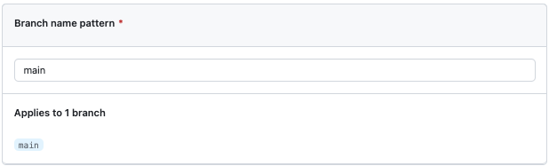
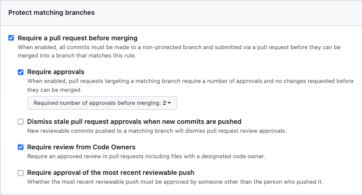
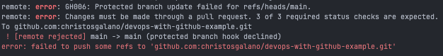
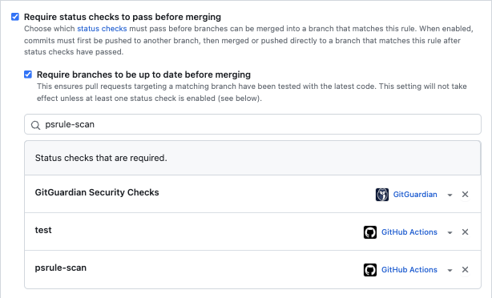
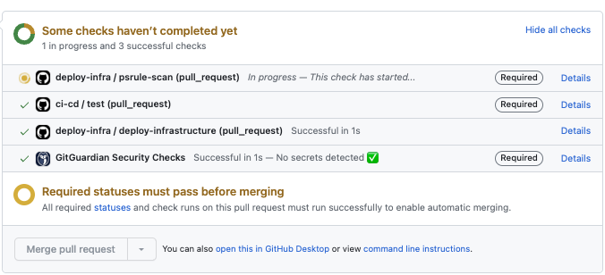
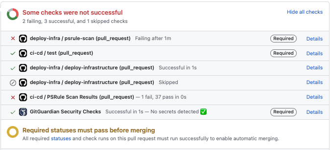
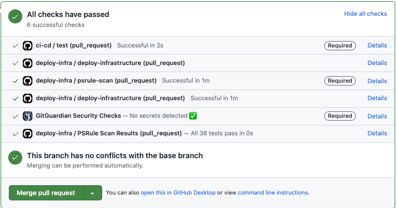
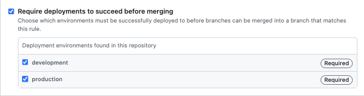
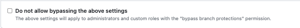

# Branch Protection rules: A guide to one of GitHub's best features

## Overview

As an engineer, you understand the critical role of cooperation and code quality. However, ensuring efficient teamwork and maintaining a high standard of code can be challenging without the right tools. This is where GitHub’s Branch Protection Rules come into play. By leveraging this powerful feature, you can enforce best practices, streamline your development process, and foster a culture of collaboration.

## What are Branch Protection Rules?

Branch Protection Rules are a set of rules that can be applied to a branch in a GitHub repository. These rules are enforced when a pull request is created, and they help ensure that the code being merged into the branch meets certain criteria. For example, you can require that all commits on a branch pass a certain number of tests before they are merged into the branch. You can also require that all commits on a branch be reviewed by a certain number of people before they are merged into the branch. These rules can be applied to any branch in a GitHub repository, and they can be customized to meet the needs of your team.

## Benefits of Branch Protection Rules

Using Branch Protection Rules can help your team maintain code quality and streamline your development process. Here are some of the benefits of using Branch Protection Rules:

- **Enforce best practices:** Branch Protection Rules enable the enforcement of best practices within your team. For instance, you can mandate that all commits on a branch must pass a specific number of tests and undergo review by a designated number of individuals before they can be merged. These rules serve as a safeguard to ensure that your team adheres to best practices, maintaining a high standard of code quality.

- **Streamline development processes:** By automating certain tasks, Branch Protection Rules streamline your development process. For example, you can set up a rule that requires all commits on a branch to pass a predefined number of tests before they can be merged. This automation not only ensures compliance with best practices but also saves time and effort by eliminating the need for manual checks, enabling a more efficient workflow.

- **Enhance collaboration:** Branch Protection Rules foster improved collaboration by enforcing peer reviews for all commits on a branch before merging. This collaborative approach ensures that multiple perspectives are considered and potential issues are identified and addressed. By making code reviews an integral part of the process, teams can collectively maintain code quality and benefit from shared knowledge and insights.

- **Reduce technical debt:** Branch Protection Rules help reduce technical debt by enforcing the requirement for all commits on a branch to require thorough review and adherence to best practices before merging. By ensuring that new code meets the defined quality standards, teams can prevent the accumulation of technical debt caused by subpar or untested code. This proactive approach contributes to a healthier codebase and reduces the future burden of addressing accumulated technical debt.

## Rules

Now let's take a look at some of the rules provided.

**NOTE:** all the examples shown below protect the `main` branch.

### Require a pull request before merging

Once activated, this rule mandates that all commits must be made to a non-protected branch and undergo submission via a pull request. Only after the pull request is reviewed and approved can the commits be merged into a branch that aligns with this rule.

Here is an example of the above rule:

In order for someone to able to merge into the main branch, they must first:

- create a pull request
- have the pull request approved by at least two persons
- have the pull request reviewed by designated code owners

Below is an example of an attempt to push directly to the main branch:

### Require status checks to pass before merging

With this rule, you have the flexibility to select the specific status checks that need to pass before branches can be merged into a matching branch. Once enabled, the workflow entails pushing commits to a separate branch first. Only after the status checks have successfully passed can the commits be merged or directly pushed to the branch that adheres to this rule.

Let's take a look at an example.

We can see that someone can only merge into the main branch if the following criteria are met:

- they create a pull request
- the pull request's branch is up to date with the main branch
- the specified status checks have passed

Below are some possible outputs of the specified rule:

If your triggers contain filtering (branch and/or path), check this out: [**Troubleshooting required status checks**](https://docs.github.com/en/repositories/configuring-branches-and-merges-in-your-repository/managing-protected-branches/troubleshooting-required-status-checks)

### Require deployments to succeed before merging

Just as with status checks, one can require that deployments succeed before merging into a branch. Once enabled, the workflow entails pushing commits to a separate branch first. Only after the deployments have successfully passed can the commits be merged or directly pushed to the branch that adheres to this rule.

So, following this logic, we can see that in order to merge into the main branch, the deployments of both the development and production environments must succeed.

### Do not allow bypassing the above settings

By default all these rules do not apply to administrators and custom roles with the "bypass branch protections" permission. In order to enforce these rules for all users, you can enable the "Do not allow bypassing the above settings" option.

## Summary

GitHub's Branch Protection Rules offer engineers and teams a range of powerful features to enhance collaboration and maintain high-quality code. By enforcing best practices, automating processes, and promoting thorough code reviews, these rules streamline development workflows and contribute to the overall success of projects.

## References

- [**About protected branches**](https://docs.github.com/en/repositories/configuring-branches-and-merges-in-your-repository/managing-protected-branches/about-protected-branches)
- [**Managing a branch protection rule**](https://docs.github.com/en/repositories/configuring-branches-and-merges-in-your-repository/managing-protected-branches/managing-a-branch-protection-rule)
