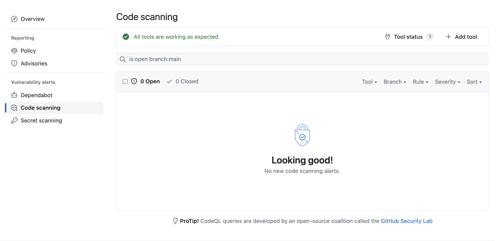

# GitHub Code Scanning: Securing Your Codebase

## Overview

As an engineer, security is a top priority, and ensuring the security of your codebase is critical. However, manually reviewing code for vulnerabilities can be time-consuming and challenging. Fortunately, GitHub Code Scanning can help you automate this process and improve the security of your code.

## What is GitHub Code Scanning?

GitHub Code Scanning is a tool that analyzes your code for security vulnerabilities, providing actionable feedback to help you remediate issues quickly. It integrates seamlessly with GitHub, and you can use it to scan your repositories automatically or manually.

## How does Code Scanning work?

Code Scanning works by analyzing your codebase for security vulnerabilities using static analysis. It looks for known vulnerabilities in third-party libraries, misconfigurations, and code that may lead to security issues. Code Scanning provides feedback on potential vulnerabilities in your code, including the location of the issue, the severity of the issue, and a recommendation for remediation.

You can configure Code Scanning to scan your repositories automatically or manually. Automatic scanning integrates with your existing workflows, providing feedback on pull requests, and preventing vulnerabilities from being merged into your codebase. Manual scanning allows you to scan your repositories on-demand, providing immediate feedback on any security issues.

## Benefits of using Code Scanning

1. Improves security: Code Scanning helps you find and remediate security vulnerabilities in your codebase, improving the overall security of your applications.

2. Saves time: Code Scanning automates the process of reviewing code for security vulnerabilities, saving you time and allowing you to focus on other critical tasks.

3. Easy to configure: Code Scanning is easy to configure and integrate into your workflow. You can set it up quickly and start receiving feedback on vulnerabilities in your codebase.

4. Reduces technical debt: Fixing security vulnerabilities can be costly, and leaving vulnerabilities in your codebase can lead to technical debt. Code Scanning helps you identify and remediate vulnerabilities quickly, reducing technical debt and ensuring the maintainability of your codebase.

## Examples

### Example 1

The example below uses Code Scanning to scan a repository for security vulnerabilities. It uses the CodeQL Action to analyze the codebase and provide feedback on potential vulnerabilities.

```yaml
name: codeql

on:
  push:

jobs:
  analyze-code:
    name: analyze-code
    runs-on: ubuntu-latest
    permissions:
      actions: read
      contents: read
      security-events: write
    steps:
    - name: Checkout repository
      uses: actions/checkout@v3

    - name: Initialize codeql
      uses: github/codeql-action/init@v2
      with:
        languages: 'python'

    - name: Perform codeql analysis
      uses: github/codeql-action/analyze@v2
      with:
        category: "/language:python"
```

Here is an example output when everything is working correctly:



### Example 2

Now let's say we were developing a different application in Javascript. Here's how Code Scanning would report a vulnerability in our code:


## Conclusion

GitHub Code Scanning is an essential tool for any engineer concerned with the security of their codebase. It helps you automate the process of reviewing code for security vulnerabilities, improving the overall security of your applications. Code Scanning is easy to configure and integrate into your workflow, saving you time and reducing technical debt. By using Code Scanning, you can ensure the security and maintainability of your codebase.

## References

- [GitHub Code Scanning](https://docs.github.com/en/code-security/code-scanning)
- [CodeQL](https://securitylab.github.com/tools/codeql)
- [CodeQL Action](https://github.com/github/codeql-action)
