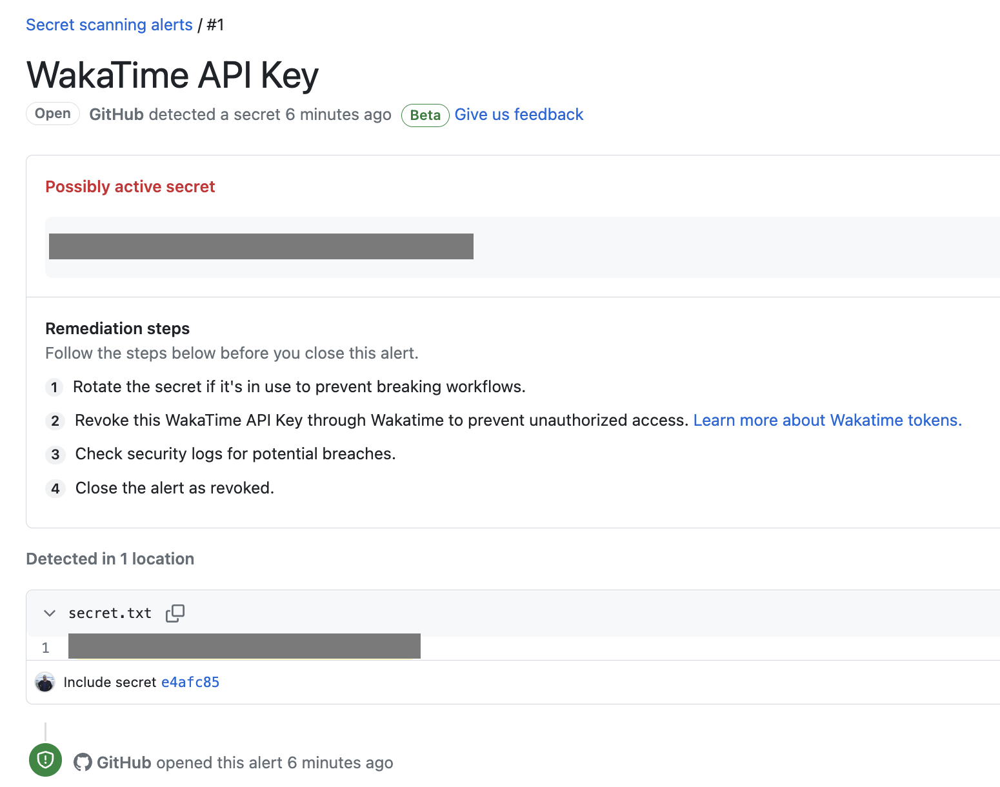

# GitHub Secret Scanning: Protecting Your Secrets

## Overview

As we all know, protecting sensitive information is critical, and securing secrets is a top priority. However, manually scanning code for secrets can be time-consuming and challenging. This is where GitHub Secret Scanning comes into play to help you automate this process and improve the security of your secrets.

## What is GitHub Secret Scanning?

GitHub Secret Scanning is a tool that scans your code for secrets, including passwords, API keys, and other sensitive information. It integrates seamlessly with GitHub, and you can use it to scan your repositories automatically or manually.

## How does Secret Scanning work?

Secret Scanning works by analyzing your codebase for secrets, using pattern matching and entropy analysis to identify potential secrets. It looks for common patterns, such as hardcoded passwords and API keys, and uses entropy analysis to identify potential secrets that do not follow a standard pattern.

When Secret Scanning identifies a potential secret, it creates an alert in your repository, notifying you of the issue. You can then investigate the alert and take appropriate action to remediate the issue.

You can configure Secret Scanning to scan your repositories automatically or manually. Automatic scanning integrates with your existing workflows, providing feedback on pull requests, and preventing secrets from being merged into your codebase. Manual scanning allows you to scan your repositories on-demand, providing immediate feedback on any potential secrets.

## Benefits of Using Secret Scanning

1. Improves Security: Secret Scanning helps you find and remediate potential secrets in your codebase, improving the overall security of your applications.

2. Saves time: Secret Scanning automates the process of scanning code for secrets, saving you time and allowing you to focus on other critical tasks.

3. Easy to configure: Secret Scanning is easy to configure and integrate into your workflow. You can set it up quickly and start receiving feedback on potential secrets in your codebase.

4. Reduces technical debt: Leaving secrets in your codebase can lead to technical debt and potential security vulnerabilities. Secret Scanning helps you identify and remediate potential secrets quickly, reducing technical debt and ensuring the maintainability of your codebase.

## Example

Let's look at an example of how Secret Scanning works. Suppose you have a repository with a file containing one or more of sensitive values mentioned [here](https://docs.github.com/en/code-security/secret-scanning/secret-scanning-patterns).

As we mentioned Secret Scanning will scan your repository and identify any potential secrets, creating an alert in your repository. So a possible alert will look like this:

You can now investigate the alert and take appropriate action to remediate the issue.

## Conclusion

GitHub Secret Scanning is an essential tool for any developer concerned with the security of their codebase. It helps you automate the process of scanning code for potential secrets, improving the overall security of your applications. Secret Scanning is easy to configure and integrate into your workflow, saving you time and reducing technical debt. By using Secret Scanning, you can ensure the security and maintainability of your codebase.

## References

- [GitHub Secret Scanning](https://docs.github.com/en/code-security/secret-scanning)
